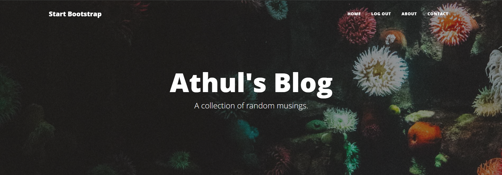

# Blog Post - Simple and Stylish



## Overview

Welcome to the Blog Post using Flask! This simple and stylish blog is built using Flask, Jinja templates, and Bootstrap for a clean and responsive design. Whether you're a seasoned developer or just starting, this blog template is perfect for showcasing your thoughts, projects, or anything you want to share.

## Features

- **Flask Web Framework:** Leverage the power of Flask for building a robust web application.
- **Jinja Templates:** Create dynamic and reusable HTML templates with Jinja to streamline your code.
- **Bootstrap Styling:** Enhance the visual appeal and responsiveness of your blog using Bootstrap.

## Getting Started

### Prerequisites

- [Python](https://www.python.org/downloads/) installed on your machine.

### Installation

1. Clone the repository:

```bash
   git clone https://github.com/Athul222/Blog-post.git
```

2. Change Directory to that folder

```bash
   cd Blog-post
```

3. Create a virtual environment:

```bash
 python -m venv venv
```

4. Activate the virtual environment:

    - On Windows:

        ```bash
        venv\Scripts\activate

    - On macOS/Linux:

        ```bash
        source venv/bin/activate

5. Install dependencies:

    ```bash
    pip install -r requirements.txt

6. Run the Flask application:

    ```bash
    flask run

- Your blog should be accessible at <http://127.0.0.1:5000>.

## Customization

1. **Add Your Content:**
    - Update the blog posts in the posts directory with your own content.

2. **Modify Templates:**
   - Customize the Jinja templates in the templates directory to match your style.

3. **Style Your Blog:**
   - Adjust the Bootstrap styles in the static/css directory to give your blog a unique look.

## Contributing

Contributions are welcome! Feel free to fork the repository, create a new branch, and submit a pull request.

## License

This project is licensed under the [MIT](License) - see the LICENSE file for details.

## Acknowledgments

- Flask: <https://flask.palletsprojects.com/>
- Jinja: <https://jinja.palletsprojects.com/>
- Bootstrap: <https://getbootstrap.com/>

Happy blogging! 🚀

```bash
Replace placeholders such as `your-username`, `path/to/your/blog-preview-image.jpg`, and others with your actual details. Customize the sections as needed based on your specific blog structure and content.
